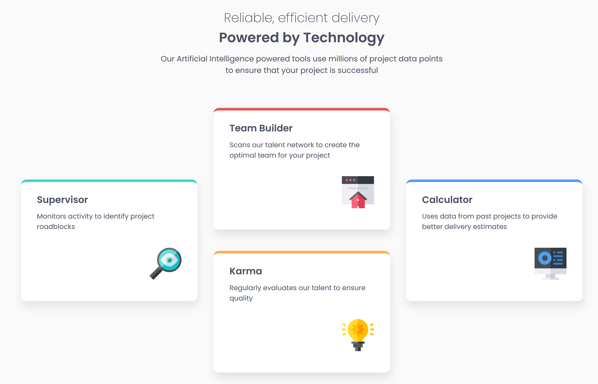
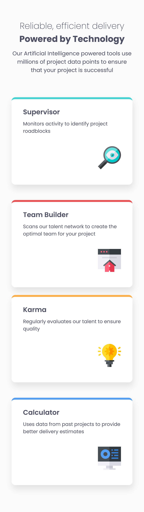

# Frontend Mentor - Four card feature section solution

This is a solution to the [Four card feature section challenge on Frontend Mentor](https://www.frontendmentor.io/challenges/four-card-feature-section-weK1eFYK). 

## Table of contents

- [Overview](#overview)
  - [The challenge](#the-challenge)
  - [Screenshot](#screenshot)
  - [Links](#links)
- [My process](#my-process)
  - [Built with](#built-with)
  - [What I learned](#what-i-learned)
  - [Continued development](#continued-development)
- [Author](#author)

## Overview

### The challenge

Users should be able to:

- View the optimal layout for the site depending on their device's screen size

### Screenshot

### Links

- Solution URL: [Solution](https://github.com/yvonnem111/four-card-feature/blob/main/index.html)
- Live Site URL: [Live](https://htmlpreview.github.io/?https://github.com/yvonnem111/four-card-feature/blob/main/index.html)

## My process

### Built with

- Semantic HTML5 markup
- CSS custom properties
- Flexbox
- Mobile-first workflow

### What I learned

It would be good to practice this kind of positioning some more.

### Continued development

Do more challenges

## Author

- Website - [Yvonne Joseph](https://www.yvonnejoseph.com)
- Frontend Mentor - [@yvonnem111](https://www.frontendmentor.io/profile/yvonnem111)

